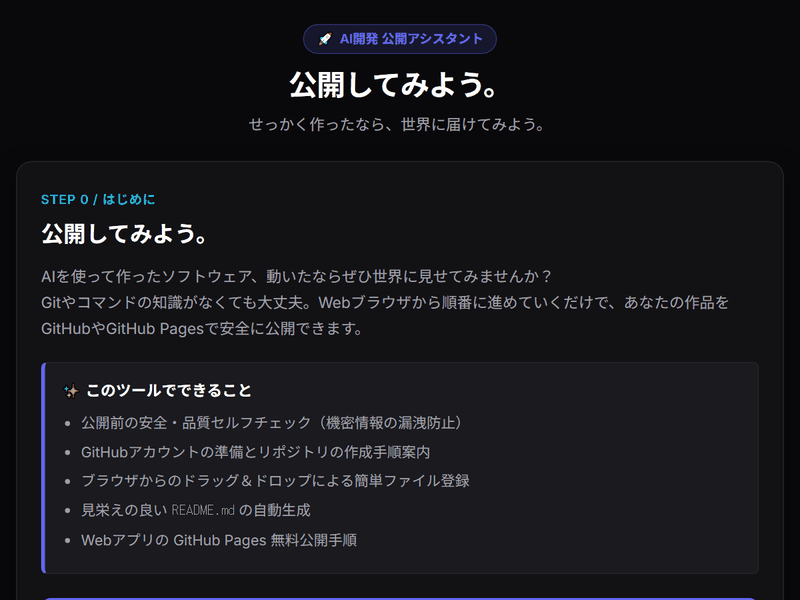

 公開してみよう。

## AI開発 公開アシスタント

> せっかく作ったなら、
> 公開してみよう。

AIを使ってソフトウェアを作った。

動いた。

自分でも使える。

でも、

> 「これ、どうやって人に見せればいいの？」

となることがあります。

このツールは、作ったソフトウェアをGitHubなどで公開するための手順を案内する小さなWebツールです。

🔗 **公開URL（GitHub Pages）**: [https://tk030-lotto.github.io/kokai-shitemiyou-tool/](https://tk030-lotto.github.io/kokai-shitemiyou-tool/)

---

## コンセプト

# 公開してみよう。

自分だけで使うのもいい。

でも、せっかく作ったなら公開してみる。

完璧なソフトウェアでなくても構いません。

小さなツールでも構いません。

まず公開してみる。

公開すると、

- 誰かに使ってもらえる
- 意見をもらえる
- バグが見つかる
- 改善点が分かる
- 次に作るものが見えてくる

ことがあります。

---

## 使い方

### 1. 公開したいものを入力

例えば、

> 「ファイル名変更ツールを作った」

> 「HTMLで小さなWebアプリを作った」

> 「Pythonで作ったCSV集計ツール」

など、簡単に入力します。

---

### 2. どこまで完成しているか確認

AIに、

- 動作確認
- README
- ライセンス
- 必要なファイル
- 公開して問題ない情報

などを確認してもらいます。

---

### 3. GitHubを準備する

GitHubアカウントを用意します。

アカウントを持っていない場合は、作成方法を案内します。

---

### 4. リポジトリを作る

GitHubで新しいリポジトリを作ります。

リポジトリ名を決め、

- 公開設定
- README
- ライセンス

などを確認します。

---

### 5. ファイルを登録する

作成したソフトウェアのファイルをGitHubへ登録します。

分からない場合はAIに聞いてみましょう。

---

### 6. 公開する

GitHubに登録できたら、

> **公開完了です。**

自分の作ったものを、他の人が見ることができます。

---

## 最初から完璧でなくていい

公開するときに、

> 「まだ完璧じゃないから公開できない」

と思う必要はありません。

小さなツールなら、

> **まず公開して、あとから直す。**

でもいい。

READMEに、

> 「現在開発中です」

と書いても構いません。

---

## GitHub Pages

Webツールの場合は、GitHub Pagesを使って公開することもできます。

今回のAI開発支援ツール自身も、GitHub Pagesでの公開を想定しています。

---

## このツールがしないこと

このツール自身がGitHubへファイルをアップロードするわけではありません。

GitHubアカウントを操作することもしません。

Git操作を自動化するツールでもありません。

目的は、

> **「GitHubで公開してみる」ための最初の手順を案内すること。**

です。

---

## 対象

- AIでソフトウェアを作った人
- GitHubを使ったことがない人
- 自分の作品を公開してみたい人
- OSSを始めてみたい人
- AI開発初心者

---

## 公開

GitHub Pagesで利用できる無料Webツールとして公開します。

インストールは必要ありません。

---

## ライセンス

### MIT License

Copyright (c) 2026 tk030

Permission is hereby granted, free of charge, to any person obtaining a copy
of this software and associated documentation files (the "Software"), to deal
in the Software without restriction, including without limitation the rights
to use, copy, modify, merge, publish, distribute, sublicense, and/or sell
copies of the Software, and to permit persons to whom the Software is
furnished to do so, subject to the following conditions:

The above copyright notice and this permission notice shall be included in all
copies or substantial portions of the Software.

THE SOFTWARE IS PROVIDED "AS IS", WITHOUT WARRANTY OF ANY KIND, EXPRESS OR
IMPLIED, INCLUDING BUT NOT LIMITED TO THE WARRANTIES OF MERCHANTABILITY,
FITNESS FOR A PARTICULAR PURPOSE AND NONINFRINGEMENT. IN NO EVENT SHALL THE
AUTHORS OR COPYRIGHT HOLDERS BE LIABLE FOR ANY CLAIM, DAMAGES OR OTHER
LIABILITY, WHETHER IN AN ACTION OF CONTRACT, TORT OR OTHERWISE, ARISING FROM,
OUT OF OR IN CONNECTION WITH THE SOFTWARE OR THE USE OR OTHER DEALINGS IN THE
SOFTWARE.

